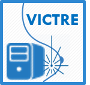

.. breastCompress documentation master file, created by
   sphinx-quickstart on Wed Sep 19 14:31:53 2018.
   You can adapt this file completely to your liking, but it should at least
   contain the root `toctree` directive.

breastCompress Documentation
============================

Welcome to the VICTRE breastCompress software documentation!

This documentation provides information regarding how to download, install, and use the VICTRE breastCompress software which models the physical compression
that breasts undergo during mammographic imaging using a finite-element based linear elasticity solid mechanics simulation.  It is designed to be used with
anthropomorphic voxelized whole-breast phantoms generated by the VICTRE breast phantom software.

	   
This software  was developed as part of the `Virtual Imaging
Clinical Trials for Regulatory Evaluation (VICTRE) project <https://github.com/DIDSR/VICTRE>`_ at the `U. S. Food and Drug Administration <https://www.fda.gov>`_.

The VICTRE tools provide a complete simulated imaging chain for mammography and digital breast tomosynthesis and are available as `open source software <https://github.com/DIDSR/VICTRE>`_

The project is in the public domain within the United States, and copyright and related rights in the work worldwide are waived through the CC0 1.0 Universal public domain dedication.
See the COPYING.txt file in this repository to view the entire CC0 dedication.

All contributions to this project will be released under the CC0 dedication. By submitting a pull request, you are agreeing to comply with this waiver of copyright interest.

This software and documentation (the "Software") were developed at the
Food and Drug Administration (FDA) by employees of the Federal Government
in the course of their official duties. Pursuant to Title 17, Section 105
of the United States Code, this work is not subject to copyright protection
and is in the public domain. Permission is hereby granted, free of charge,
to any person obtaining a copy of the Software, to deal in the Software
without restriction, including without limitation the rights to use, copy,
modify, merge, publish, distribute, sublicense, or sell copies of the
Software or derivatives, and to permit persons to whom the Software is
furnished to do so. FDA assumes no responsibility whatsoever for use by
other parties of the Software, its source code, documentation or compiled
executables, and makes no guarantees, expressed or implied, about its
quality, reliability, or any other characteristic. Further, use of this
code in no way implies endorsement by the FDA or confers any advantage in
regulatory decisions. Although this software can be redistributed and/or
modified freely, we ask that any derivative works bear some notice that
they are derived from it, and any modified versions bear some notice that
they have been modified.

.. toctree::
   :maxdepth: 2
   :caption: Contents:

   operation
   installation
   running
   files
   notes
      

