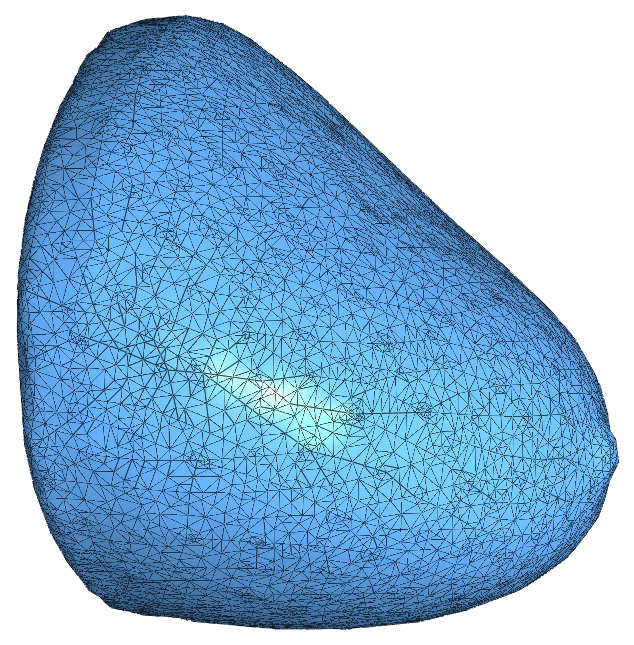
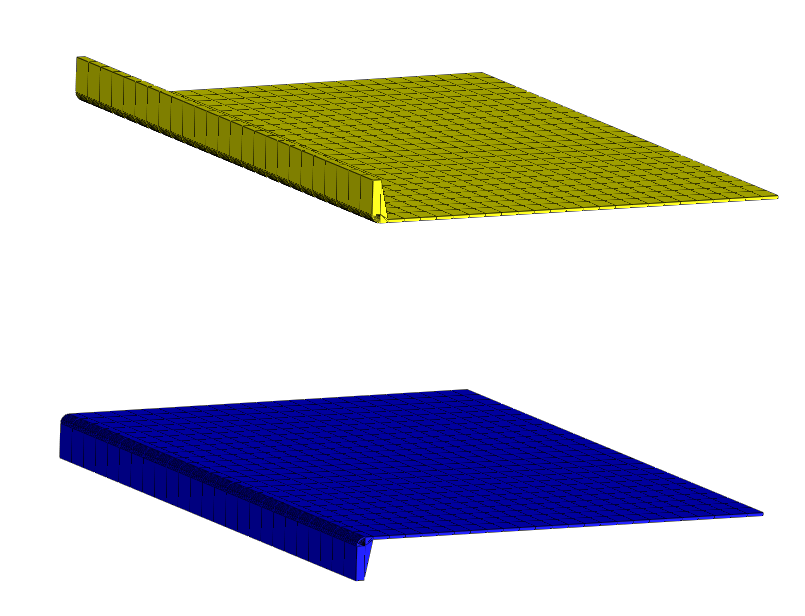
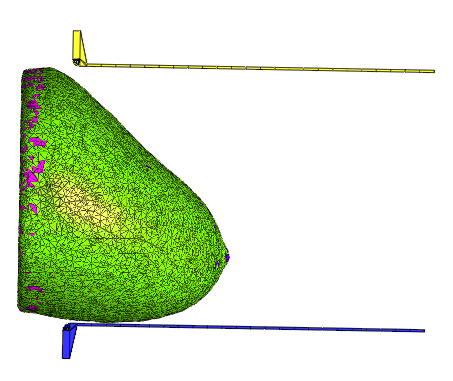
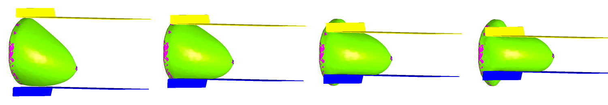

Overview
========

The breastCompress code uses finite element solid mechanics to model the compression of a breast between two planar surfaces.  The general procedure is as follows:

1) Load uncompressed voxelized breast phantom file
2) Create tetrahedral mesh for breast volume

   Tetrahedral mesh

3) Assign linear elasticity properties (Poisson's ratio and Young's modulus) for each tetrahedron.  Currently only glandular or fat elasticity parameters are assigned.
   Tetrahedrons containing muscle serve as a fixed boundary condtion during the compression similation.
4) Virtual compression plates are generated and placed above and below the breast model.  EXPERIMENTAL: These plates can be rotated an arbitrary angle to simulate different compressed views.

   Paddle mesh design
   

   Initial paddle position

5) An XML FeBiO input file is generated based on the phantom geometry and passed to a spawned FeBiO process that performs the compression simulation.
6) Compression plates are moved towards each other until the desired compressed thickness is achieved.

   Compression progression as plates are moved together

7) The obtained displacement maps at each finite element node are interpolated to determine where each voxel in the uncompressed breast moved to during compression and
   a new voxelized compressed breast phantom, including the compression paddles is generated and saved in the output file.

.. note::  If the compression simulation fails to converge at the desired compressed thickness, intermediate voxelized phantoms are saved to disk and the current breast shape is re-meshed.  Depending on the breast shape, position of the paddles, and desired thickness, multple remeshing steps may be required.

